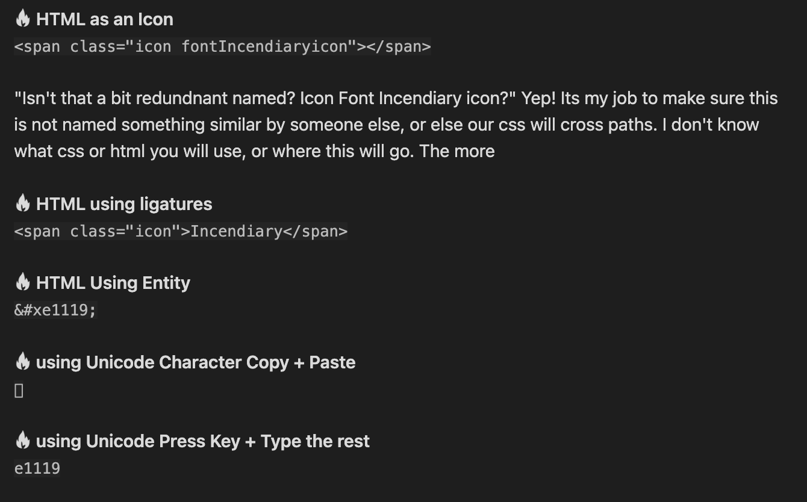
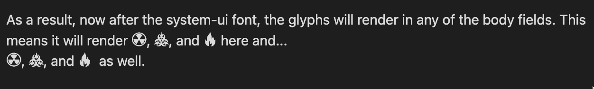
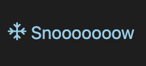
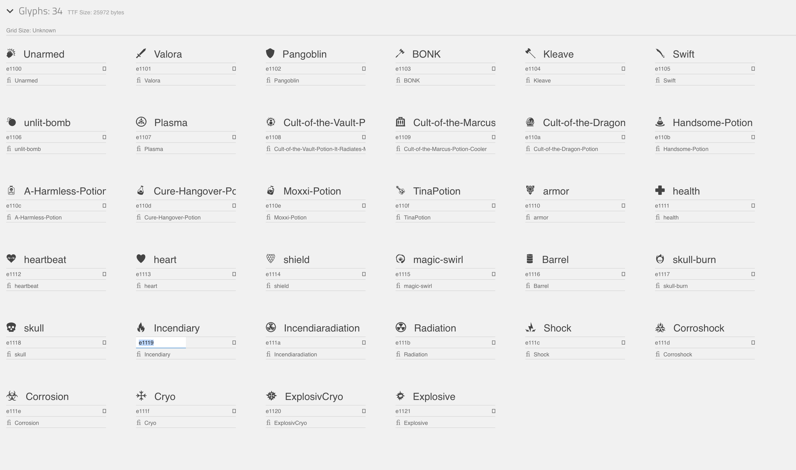

# Readme Introduction

Hello! This is a readme for an embedded `.css` file made up of currently 34 `.svg` icons that have been turned into a font, or glyphs. These glyphs have been configured to start taking up slots beginning at unicode e1100 range. If you already have custom fonts at the e1100 range, let me know and we can figure this out. 

Please note... You will not be able to see the icons in this Readme properly until you have loaded the css snippet or installed the fonts. This includes whether you read it in Obsidian, or installed them on your computer and enabled them in your browser. The image at the end shows you what the font icons look like, and all the images used in SVG format can be found in the [Assets](../../Assets) directory.

> This line will be updated with a link to the SVG-CSS snippet when completed.

## Files you will need

1. [Bunkers-Font-Icons-V1](_attachments/Bunkers-Font-Icons-V1.css)
2. All the files in the [Fonts](../Fonts) directory if you want the physical fonts to encode into your website.

### Optional Files

1. Development Files: including .scss files, .js files, and extra css for older IE browsers

## How to Use

In most cases, it is as simple as taking the contents of the css file, and pasting it into the top of an existing css file. Most established css files have a `@font-face` section. If not, the css will create one for you. After that, you will need to create the circumstances for when you want these glyphs to show. Let me present the example for the TTRPG Statblocks. 

### Highly Specific Areas

```css
.statblock.bunkers,
.statblock.bunkerscharacters,
.statblock.bunkersfamiliars,
.statblock.bunkersvehicles {

/* Statblock Font Types */
--statblock-content-font: system-ui, 'Bunkers', -apple-system, BlinkMacSystemFont,
"Segoe UI", Roboto, Oxygen, Ubuntu, Cantarell, "Open Sans", "Helvetica Neue",
sans-serif;
--statblock-heading-font: system-ui, 'Bunkers', -apple-system, BlinkMacSystemFont,
"Segoe UI", Roboto, Oxygen, Ubuntu, Cantarell, "Open Sans", "Helvetica Neue",
sans-serif;
}
```


Statblocks is already set up to skin these two variables towards `p` and `h1-h6` respectively in css, and because I indicated .bunkers and several other bunkers compounds words, even if I am using a statblock layout for another game, the font wont be changed (and the glyphs wont show) unless the is currently toggled to one of the four listed.

"That's great and all, but I just want one line. What do I do?" I have your solutions!

**󡄙 HTML as an Icon** 
`<span class="icon fontIncendiaryicon"></span>`

"Isn't that a bit redundnant named? Icon Font Incendiary icon?" Yep! Its my job to make sure this is not named something similar by someone else, or else our css will cross paths. I don't know what css or html you will use, or where this will go. The more 

**󡄙 HTML using ligatures**
`<span class="icon">Incendiary</span>`

**󡄙 HTML Using Entity**
`&#xe1119;`

**󡄙 using Unicode Character Copy + Paste**
`󡄙`

**󡄙 using Unicode Press Key + Type the rest**
`e1119`


*Image for those who still are working to install the font.*


***

### One Webpage or One Note

What about in the entirety of the note as I am now? There is a table below that I am using to show you how to change the icons. How am I doing it there? Individual web pages, or in Obsidian's case, notes, can have selective toggling of css per page. Here are how the two line up in language terms.

| **Obsidian**      | **Website**        |
| ------------- | -------------- |
| Default Theme | Base Website   |
| Snippet       | Additional CSS Stylesheet |
| CSS Class     | Additional Link-ref               |

At the top of this page you may notice the `cssclass: Bunkers`. Before creating this readme, I added the following code to the Bunkers.css.

```css
body {
--font-default: system-ui, 'Bunkers', -apple-system, BlinkMacSystemFont,
"Segoe UI", Roboto, Oxygen, Ubuntu, Cantarell, "Open Sans", "Helvetica Neue",
sans-serif;
}
```


As a result, now after the system-ui font, the glyphs will render in any of the body fields. This means it will render 󡄛, 󡄝, and 󡄙 here and...
󡄛, 󡄝, and 󡄙  as well.

*Image rendition*


***

Realistically, I would never usually go as broad as body, but it is contained within this one file because of the `cssclass: Bunkers`. The equivalent in html is `<link rel="stylesheet" href="style.css">`.

Which, is how you also would use it throughout your entire site, but once you begin doing that, you stop using embeds and you go straight to using font file, which is found in the font folder. As I mentioned before, reusing glyphs can be a problem in broad cases, and are used in short term to maximize compatibility. 

## How do I change the color of the font?
Normally you would change it in css with whichever field you are calling it in. 

```css
body {
color: blue; /* this colors text blue*/
background-color: red; /* this colors background red*/
}
```

However the font file does contain individual classes for each icon, so you can ensure certain specifications happen to the icon everytime its used.. Or you can color it individually when using it... <p style="color: skyblue">󡄟 Snooooooow</p>

````html
<p style="color: skyblue">󡄟 Snooooowwww</p> U+e111f
````


*Image Rendition*


---

## Table of Font Icons

| **Name**              | **Icon** | **U+ Key** |  **Entity**   | **Ligatures** |
| --------------------- | -------- | ---------- | --- | ------------- |
| **Unarmed**           | 󡄀        | e1100      | `&#xe1100;`    | Unarmed       |
| **Valora**            | 󡄁       | e1101          | `&#xe1101;`    | Valora        |
| **Pangoblin** | 󡄂       | e1102       | `&#xe1102;`    | Pangoblin  |


### Image Table of Font Icons

