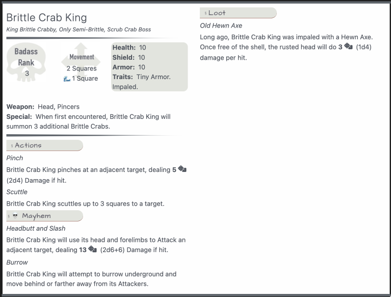

# Bunkers & Badasses Statblock Layout for Obsidian TTRPG Plugin

## What Does it Looks Like?


## The Codeblock: Bestiary
Note: `Layout: BunkersBestiary` Must be placed within the codeblock during the following conditions:
1. If BunkersBestiary is not your default layout.
2. If you have a monster or entity that shares the same name in another universe and thus would have a stat block in another layout. Example. Ancient Red Dragon.

Once the Code Block is saved the first time, you will be able to call the entity manually with the following codeblock.

````yaml
```statblock
monster: monstername
```
````

### Example Homebrew Baddass Boss Statblock Layout
````yaml
```statblock
# Layouts until other style of releases should be BunkersBestiary
layout: BunkersBestiary
source: Bunkers-Example
dice: true
# If Its a Badass or a SuperBadass, make sure to put that First... Badass Potion Master... SuperBadass Treant
Name: "Super Badass Deep Dragon"
# "Landshark."
Type: "Dragon."
# Title of the Boss here, like King of the Hill or Wakisobi
TitleOfMob: "Cruncher of Rocks"
# Flavor Text Here such as Really Loves Fish
FlavorText: "Rocks means your bones actually"
# Miniboss, NPC, Made-Up Boss…
TypeOfBoss: "Miniboss"
# Self Explanatory, right? What is its BR
BadassRank: 63
# Options are move, flight, swim, burrow, teleport, hover, Leap,climb, 
MovementType: "move 4 flight 6 teleport 2"
# Hitpoints
Health: 600
# Shield Points
Shield: 150
# Armor Points
Armor: 100
# Any existing Traits. Want to randomize it? Add Random, Random 2, or Random 3. 
Traits: Large. Random 3.
# What weapon does it use?
Weapon: "Breath, Bite (+6 Damage)"
# Any special stuff we ought to know?
Special: "If the dragon gains any elemental traits upon starting the encounter, it will gain elemental aura with a range of three squares, dealing 2d6 (2d6) elemental trait damage to all creatures besides itself per turn."
# Super_Special is for use with some weird entities like Potion Master and some Bosses. Usually leave the name blank as "".
SuperSpecial:
- name: "Fixation"
  desc: "After performing an Air Bite the Dragon will become fixated on the target for two turns, and will pursue the target up to its maximum flight speed per turn."
# Main Actions. Leave Empty if None
Actions:
- name: Breath Missiles
  desc: "The dragon snorts out 2 breath missiles from it's nostrils that target the nearest two players who are not in full cover. The missiles move at the speed of dragon's teleport. If the missiles connect to their target(s), they deal 1d20 (1d2) Cryoshock damage and apply [[Slow]]."
- name: Bite
  desc: "If Landed, the Dragon charges up to 3 squares and Bites up to 2 adjacent targets for 2d10+3 (3d10+3) Damage per Bite."
- name: Air Nibble
  desc: "If flying and adjacent to 1 target, the Dragon nibbles that one target for 2d10 (1d10) Damage. The dragon has a 1d4 (1d4) chance of following the target next turn."
# Mayhem Actions. Leave Empty if None
Mayhem: 
- name: Deep Breath
  desc: "The dragon exhales a deep breath of in a seven square cone in front of it, dealing 7d6 (7d6) Cryoshock damage. This ability costs two mayhem points." 
- name: Air Bite
  desc: "If flying and adjacent to 1 target, the Dragon bites that one target for 4d10 (4d10) Damage. The dragon enter _fixation_."
# Does this Entity Carry Super Special Loot? Leave Empty if None
Loot:
 - name: A Purple Scale
   desc: "This Deep Dragon was carrying a strange, purple scale, embossed with a series of scratches."
# Does this Entity Have an Image? Accepts Wikilink or Markdown Link. Leave Empty if None
ImageBig: ""
```
````

### How to Install
1. Download [Bunkers.json](_attachments/Bunkers.json) and import it into your Obsidian TTRPG Statblocks Plugin.
2. Download [BnB-TTRPG-Statblock-Monsters](_attachments/BnB-TTRPG-Statblock-Monsters.css) and place into your `.obsidian/snippets` directory.
3. Enable the snippet.
4. Copy the code block above and surround with the ` ```statblock ` codeblock. Confirm you see a screenshot similar to above.

## How to Use: Movement
The Movement property currently supports the following items:

- move x
- leap x
- burrow x
- flight x
- teleport x
- swim x

x equals the amount of squares the monster can move.

You can use any of these, and it will list them under the movement arrow, along with an icon indicating what type of movement and how many squares it will move. Do not use commas.

*Hover can be treated the same as flight, or be utilized as a Trait.*

## How to Use: Traits
Traits currently will wrap text if you have a monster that has many traits. However, this can make your code-block very, very big and weird looking. If possible, try to make your custom traits a special or an action.

## How to Use: Loot
The Loot section is intended only for the weird, obscure loot items you want to absolutely include on a monster in that bestiary at all times, typically bosses who drop a peculiar quest item. The is optional and if there is nothing entered in loot, the field disappears.

## Explanatory Codeblocks
