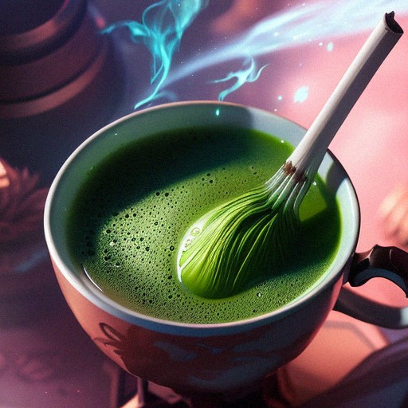

# Recipe: Matcha Latcha
> [!abstract] [Creature Feature](../../../../60-Wyrmscriber/0-Courier/Resort-Me/Creature%20Feature.md): Recipes and More…
> Welcome to another transcribed version of week's edition of *Creature Feature: Recipes and More*… I'm your lovely, brilliantly shining unicorn host, Devvie Tells! This week in our recipe section, we have the famous Matcha Latcha, presented by its very creator, [Jrust](../../../../60-Wyrmscriber/0-Courier/Locations/Wonderlands/Lightspire/Brighthoof/Glitteryards/The-Handsome-Hag/Jrust.md), owner and proprietor of Brighthoof's first and only lesbian bar [The Handsome Hag](../../../../60-Wyrmscriber/0-Courier/Locations/Wonderlands/Lightspire/Brighthoof/Glitteryards/The-Handsome-Hag/The-Handsome-Hag.md). Take it away Lady Jrust.
> \- Devvie Tells

>[!quote] Thank you Devvie. I'm sure your readers are acquainted with the dual purpose concoction of Matcha Latcha: an edible skin or scale paste. Today, I've decided to reveal the recipe for those brave enough to make it at home. Let's begin.

 

**Ingredients**
- Three Fresh [GOB-lin](../../../../60-Wyrmscriber/Gamemaster/Mechanics/Bestiary/Goblinoids/Gob-Lins/Gob-Lins.md) Bouncing Beans from unwilling donors, mashed.
> [!quote] **Note**: *Pickled and Dried GOB-Lin Bouncing Beans will produce hallucinogenic effects, and may be considered a poison. I and the Handsome Hag are not liable for any resulting deaths as the result of any misapplication of the recipe.*
- Two [Troll](../../../../60-Wyrmscriber/Gamemaster/Mechanics/Bestiary/Trolls/Troll.md) Toes, crushed. Any variant will do.
- One barrel of [Adult-Skag](../../../../60-Wyrmscriber/0-Courier/Resort-Me/Adult-Skag.md)'s blood; Normal Variant Only. May also be found as [Blood-of-the-Skag](../../../../60-Wyrmscriber/0-Courier/Resort-Me/Blood-of-the-Skag.md).
>[!abstract] What happens if the reader uses a different variant of Skag, such as a Spitter or a baby skag? \- Devvie
>> [!quote] The recipe tastes like a horses ass. Moving on…
- One satchel of powdered Green Tea Leaf, available for purchase at any purveyor of fine Tea Leaf.

**Instructions for External Use**
1. Combine ingredients into a thick paste in a mortar and pestle
>[!quote] If any hard lumps remain, you did not process your ingredients to specification. Pour the mixture onto a flat surface and beat your head against it until the ingredients are pliable and you have learned your lesson.
>> [!abstract] That's a bit harsh isn't it? \- Devvie
>>> [!quote] … No.
1. Spread the paste over external body part of choice. Our customers routinely prefer using it on their face, shoulders, upper chest, or buttocks.
>[!quote] Please avoid use over reproductive genitalia, as it may promote shrinkage.
>>[!abstract] For women too?! \- Devvie
>>>[!quote] … Yes
1. Let the paste work its magic for up to fifteen minutes.
2. Wipe off and discard with a green cloth, or wipe off and prepare a beverage with a white cloth.

**Instructions for Brewing from Paste**
To brew without the initial drying period associated with external use, perform the following:
1. Add enough water to the paste to be able to be able to whisk with the viscosity of split pea soup.
2. Consume immediately.
3. Optional: Add the white stuff those humans always ask me about. Soy something.
>[!quote] I've heard about this almond milk. Where does almonds get the milk?

**Instructions for Brewing from White Cloth**
To brew after the paste has been dried and use as a chemical exfoliant, perform the following:
1. Place into a small pot of boiling water.
2. Wait for the water to turn split pea green.
3. Continue from Step 2 with the instructions for Brewing from a paste.

>[!quote] Before you ask me, the white cloth is enchanted to be an absorbent to the ingredients in the Matcha Latcha, and an adsorbent to everything else. I'm not a hag for nothing and take my education and concoctions seriously. Why, this human called a sci-un-test tried to tell me how my methods could not make any sense. I wonder if he could make sense that he was on our menu last week. The fool did not understand that things work differently here in the Wonderlands.
>>[!abstract] Ah Lady Jrust, we are running out of time. \- Devvie
>>>[!quote] Ah, now where was I…. oh yes, the recipe!

Enjoy your Matcha Latcha. For the confidant woman\* who wish to enjoy this delight at home, there are to-go packs for sale during our normal business hours.

<i>If you are of the male, variety and wish to take advantage of this recipe and offer, please come in the back of the Handsome Hag to make your order. We have some special wavers for you to sign. Also, per legal notice, I must inform you that you may not necessarily leave the establishment with the entirety of your person intact.</i>
