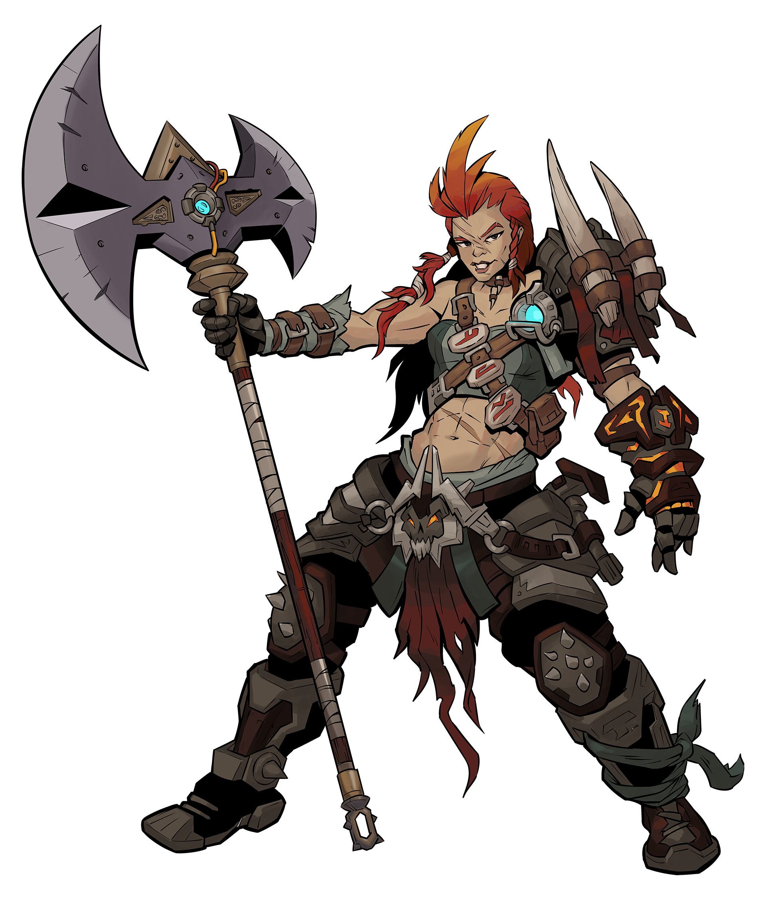

# Brr-Zerker

>[!homebrew]
> __Warning__: This page is a Homebrew class of Tiny Tina Wonderlands' Brr-Zerker.

>[!infobox|right]
># `=this.skilltree` `=this.class`
>
> ###### Class Features
> | ___Type___ | ___Stat___ |
> |:---|:---|
> | __Melee Die__ | `=this.meleedie` |
> | __ACC__ | +`=this.accuracy`|
> | __DMG__ | +`=this.damage` |
> | __SPD__ | +`=this.speed` |
> | __MST__ | +`=this.mastery` |
> | __Class Feat__ (_Optional Homebrew_) | `=this.classfeat` |

 Brr-Zerker is a formidable warrior, one who has honed their body and spirit to withstand the harsh realities of their frozen home. Trained from birth in the art of battle, these warriors are as comfortable wielding a mighty two-handed axe as they are summoning the power of frost to freeze their enemies in place.

However, there is more to the Brr-Zerker than just brute strength and icy abilities. These warriors are also skilled in the use of occult magic, able to leech life from their foes and fuel their own rage in the heat of battle. And when their fury reaches a boiling point, they can unleash their full potential through their Action Skills, transforming into a whirling maelstrom of destruction.

But beware, for the Brr-Zerker is not to be underestimated. They are bound to spectral entities, ancient spirits who lend their power to the warrior in exchange for their unwavering loyalty. It is this bond that allows the Brr-Zerker to harness the power of frost and channel it into their melee attacks, turning their weapons into instruments of icy death. So beware, for the Brr-Zerker is a force to be reckoned with on the battlefield, a relentless warrior who will stop at nothing to see their enemies defeated.

## Action Skill
**Feral Surge**: Leap forward up to 4 squares, dealing `dice: 1d6` Cryo Damage to each Target in or adjacent to any square moved past. 
(MST Mod per Day + 1/Encounter)

## Skill Tree

| Tier 1 Skills |  |
|---|---|
| Ancestral Frost | +1/SL Cryo Damage. +1/SL to Traverse Checks. |
| Savagery | +1 Melee Damage/SL. Increase Enrage duration by 1/SL. |
| Unyielding | Gain +2 Health Regen/SL. While Enraged, double your Health Regen. |
| Running Start | Feral Surge gains +2 Leap Range/SL. +1 SPD. |
| __Tier 2 Skills__ |  |
| Ice Breaker | Gain +1 Damage/SL vs Slowed Targets. Gain +2 Damage/SL vs Frozen Targets. |
| The Old Ways | Gain +2 Damage/SL and +1d4 Damage Reduction/SL vs Adjacent Targets. |
| Instinct | +1/SL to Insight Checks. While Enraged, +2/SL to Insight Checks instead. |
| Looking for a Beating | +1/SL to Search Checks. If SL is 3, your first Melee Attack each Encounter deals Max Damage. |
| __Tier 3 Skills__ |  |
| Cold Snap | +1 Movement/SL. +1 Cryo Damage/SL. Double these bonuses while Enraged. |
| Unarmored Defense* | Reduce your Max Shield Capacity by half. Increase your Max Health by twice that amount. |
| Blood Frenzy | When you kill a Target, gain 1d8+MST Mod Health/SL. +1 Enrage Duration/SL. |
| Flyting | +1 Melee Range/SL. +1/SL to Talk Checks. |
| __Tier 4 Skills__ |  |
| Ancient Fury | 10+MST Mod Health/SL. +2 Splash Damage/SL. |
| Relentless Rage* | The first time Health reaches 0 in a day, gain 4d10 Health. If you have Rage of the Ancients, you then become Enraged. |
| Snow Stalker | +1/SL to Sneak Checks. |
| The Ice Age | Feral Surge gains 1d6/SL+MST Mod Damage. +1 ACC. |
| __Tier 5 Skills__ |  |
| Blast Chill\* | When you Melee Attack, roll 1d20. On a 16+, deal 2d8 Cryo Damage to all adjacent Targets. +1 DMG. |
| Iron Squall | Your Favored Weapons get +1 Hit/SL. If SL is 3, gain an Extra Melee Attack each turn. |
| Avalanche* | Gain +2 Melee Damage for every unique Square you move through before attacking on your Turn. |
| Ham Fisted | +1 Melee Damage/SL. +1/SL to Interact Checks. Double these bonuses while Enraged. |
| __Tier 6 Skills__ |  |
| Blood of the Fallen\* | When you kill a Target, you may activate Feral Surge for free. +2 MST. |
^bunkersBrrZerkerTree

>[!meta]- Class Inline Metadata
> accuracy:: 0
> classfeat:: [Rage of the Ancients](Rage-of-the-Ancients.md)
> damage:: 2
> image:: [Brr-Zerker.png](_attachments/Brr-Zerker.png)
> mastery:: 1
> meleedie:: __1d10__
> skilltree:: Brr-Zerker
> source:: __Homebrew__
> sourceurl:: [Scout's B&B DLC 3: Into the Wonderlands](https://docs.google.com/document/d/1MLOgrWwcLNTnP9PuXrKiLImy7SUh4hXO8arVUAlmdp0/edit)
> speed:: 1
> stats:: 0 ACC 1 DMG 2 SPD 1 MST
> class:: Berserker
